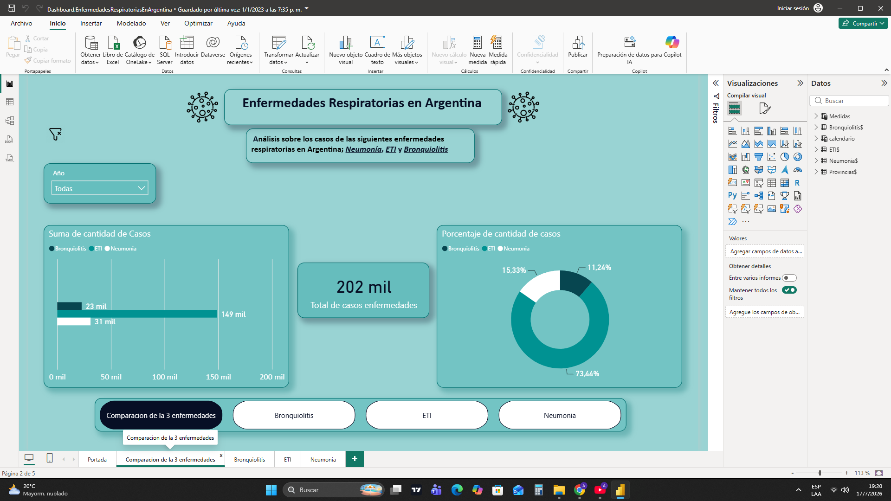

# Dashboard-Enfermedades-Respiratorias
   
  
Dashboard interactivo desarrollado en Power BI para el análisis de enfermedades respiratorias en Argentina.

Herramientas Utilizadas: 
-Power BI
-Power Query
-SQL
-Excel

Objetivos: 
- Analizar la evolución de los casos.
- Comparar indicadores por provincia.
- Visualizar tendencias mediante dashboards.

